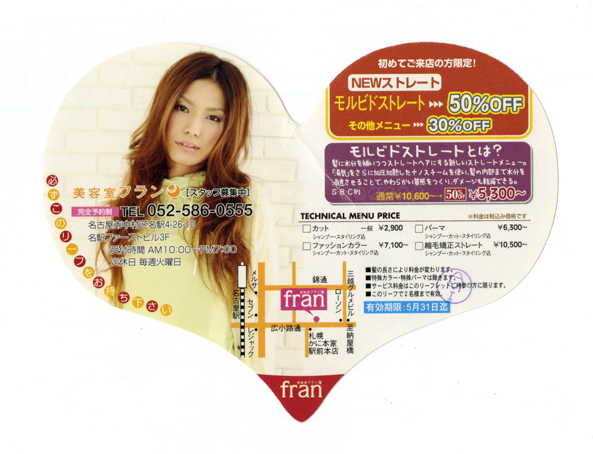

<h3 class="title is-5" >前回課題課題「HOTEL TRIGEN」のステーショナリーグッズ発表</h3>

前回、完成したステーショナリーを机上に置いて発表してもらいます。

<h4 class="title is-6">話してもらう内容</h4>

- どんなホテルをイメージしたのか？
- ロゴの説明（何をモチーフにしたのか。なぜそのモチーフにしたのか、など）
- グラデーションの使いどころ
- どのような考えで、そのデザインに行き着いたのか。

<h3 class="title is-5" >変わった形のレイアウト</h3>
<figure class="is-fullwidth slide">
  <iframe src="https://drive.google.com/file/d/1bGnhCPRjEQibTZKhm1T1G76gqNYRl89U/preview"></iframe>
</figure>

<h3 class="title is-5" >課題「美容室エフ81」変わった形なフライヤー</h3>

四角形や円など、幾何学的な範囲にシンプルな要素をレイアウトしてきました。  
デザインの現場では、さまざまな情報を決まった範囲に、バランス良く収め、  
雰囲気や伝えたいことを的確に判断してデザインする必要があります。

- 課題：ハート型の枠に必要な情報をレイアウトして、美容室F81のフライヤーを作成してください。
- 必要事項：①テキストデータ（店舗情報、料金メニュー、クーポン、技術説明、注意事項）、②写真1点以上（モデル他）、③地図、④ロゴ（※デザインしてください）
- 締め切り：2020年8月5日（水）2限目 印刷・講評・提出

<h4 class="title is-6">制作手順</h4>

1. 素材を[ダウンロード](https://drive.google.com/drive/folders/1KeldsP5RpnYCTXFgmULA1Isqy_mHtVyw?usp=sharing)するか、f81srv1からコピーしてください。
1. ハート型のレイアウト用紙にラフを描く
1. ロゴも考えてください。
1. Illustratorに必要な要素を配置（まだレイアウトしない）
1. ラフで描いたデザインを参考にレイアウトしていく。  
※ラフを描く時に、色鉛筆や色ペンを使うことでカラー計画も1枚でできます。

__締め切り：2020年8月5日（水）印刷、授業内で講評__→前期「グラフィックデザイン」終了

<h3 class="title is-5">ルーブリック評価票</h3>

必要な情報を的確に判断し、優先順位をつけた上で、美容室らしい印象を与えるデザインになっているかがポイントです。  
紙のデザインは、手に持ってから見ることから、最初の視点をどこに向かわせるのか、  
またスクロールができませんので、最初の視点からの誘導で、  
最終的に「この美容院に行ってみよう」と感じさせるための工夫が必要です。  
どのような戦略でレイアウトしたのかを説明してください。

+ 縦軸＝評価項目：観点（提出物、授業態度などに評価対象を分類したもの）
+ 横軸＝レベル：尺度（達成レベルをアルファベットや数字で数段階に分けて示したもの）
+ 評価ランクの目安
  + C：課題意図を理解できていない、または技術が大幅に足りない。
  + B：課題意図を理解できているが、表現力・技術が足りない。
  + A：課題内容を理解し、適切な表現がされている。
  + S：適切な処理がされており、さらに優れたアイデアが取り入れられている。

<h4 class="title is-6">評価ポイント／評価ランク</h4>
<table class="table is-bordered is-striped is-narrow is-fullwidth">
<thead class="table-top">
    <tr>
        <th>評価ポイント／評価ランク</th>
        <th>C</th>
        <th>B</th>
        <th>A</th>
        <th>S</th>
    </tr>
</thead>
<tbody>
    <tr>
        <th>仕様</th>
        <td>変わった形の中に、必要な要素が盛り込まれてないか、強引な変形で無理やり押し込まれている。</td>
        <td>変わった形の中に必要な項目は入っているが、バランスが悪い。</td>
        <td>全て仕様通りに作成されており、適切な場所にバランスよく配置されている。</td>
        <td>全て仕様通りに作成されており、仕様内で様々な試みがされており、講師も気付いていないアイデアを提案してある。</td>
    </tr>
    <tr>
        <th>文字の処理</th>
        <td>フォントの選択、サイズ、行間、文字間に処理がされていない。 
        もしくは、著しく処理が未熟なためバランスが悪くみえる。 
        アイデアがみられない、もしくはアイデアが不適切。</td>
        <td>フォントの選択、サイズ、行間、文字間のどれかに処理がされているが、適切な処理ではないものも含まれる。 
        アイデアは良いものの技術が未熟。</td>
        <td>フォントの選択、サイズ、行間、文字間のすべてに適切な処理がされており、バランスよくレイアウトされている。 
        よく考えられたアイデアが適切な技術で表現されている。</td>
        <td>フォントの選択、サイズ、行間、文字間の扱いの処理に加えて、その処理を施したことにより、他の要素を引き立てる働きを意識的に加えてある。 
        フォントについても意図的に考えて使用されており説明ができる。 
        秀逸なアイデアで目を引くものになっている。</td>
    </tr>
    <tr>
        <th>トーン＆マナー</th>
        <td>課題の意図を把握しておらず、色の選択、余白、装飾などの統一感がない。 
        音楽との雰囲気も合っていないと感じる。</td>
        <td>要素の一部には、雰囲気を感じるものの、全体的に弱い。 
        統一感は見られるものの、大きさのバランス、配色などが崩れている。</td>
        <td>課題の意図を把握し、資料などを参考に適切な雰囲気の配色・ビジュアルで統一されている。 
        また、音楽のリズム感と造形がシンクロしていると感じる。</td>
        <td>課題の意図を把握し制作しているだけでなく、さらにテーマに準じた配色・ビジュアルが過不足無く施されている。</td>
    </tr>
     <tr>
        <th>レイアウト</th>
        <td>それぞれの項目のメリハリが悪く、情報が読みづらい、伝わりづらい。</td>
        <td>項目のまとまりはあるものの、優先順位がわかりづらく、伝えたいことが曖昧と感じる。</td>
        <td>変わったレイアウトではあるものの、最初の視点から誘導され、伝えたいことが全て視線に入る。</td>
        <td>グルーピング、優先順位、視線誘導などがバランスよく取り入れられ、情報がスムーズに入ってくるだけでなくスタイリッシュな美容院の雰囲気も伝わってくる。</td>
    </tr>
</tbody>
</table>

