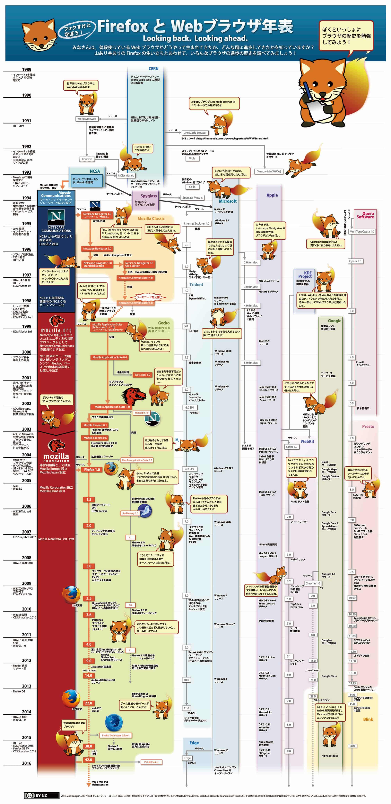

<h3 class="title is-5" >Webブラウザ</h3>
<figure class="is-fullwidth">
  <iframe src="https://drive.google.com/file/d/1lSI1xBALvBINW1zCv6rpHLERIf1iVtr2/preview"></iframe>
</figure>
<h3 class="title is-5" >Webブラウザの歴史</h3>
<figure class="is-fullwidth">

</figure>

<h3 class="title is-5" >【宿題】探してみようマニアックなWebブラウザ</h3>

モダンブラウザ（Chrome, FireFox, Edge, Safari）以外にもたくさんWebブラウザが開発されています。 
実際にどんなブラウザがあるか探してみよう。

+ ブラウザ名
+ HTMLレンダリングエンジン

