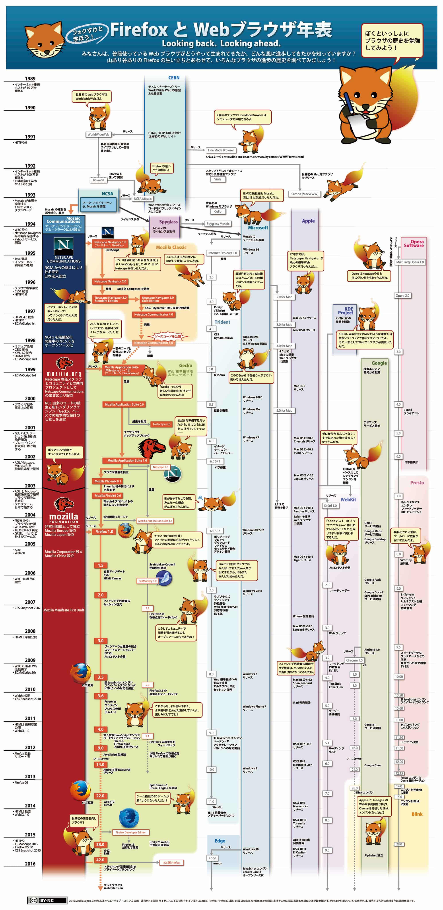

<h3 class="title is-5" >Webブラウザ</h3>
<figure class="is-fullwidth">
  <iframe src="https://drive.google.com/file/d/1lSI1xBALvBINW1zCv6rpHLERIf1iVtr2/preview"></iframe>
</figure>
<h3 class="title is-5" >Webブラウザの歴史</h3>
<figure class="is-fullwidth">

</figure>

<h3 class="title is-5" >【宿題】探してみようマニアックなWebブラウザ</h3>

モダンブラウザ（Chrome, FireFox, Edge, Safari）以外にもたくさんWebブラウザが開発されています。 
実際にどんなブラウザがあるか探してみよう。

+ ブラウザ名
+ HTMLレンダリングエンジン

<h3 class="title is-5" >授業録画</h3>

<figure class="is-fullwidth">
<iframe width="560" height="315" src="https://www.youtube.com/embed/tPQKIWQ_K5Q" frameborder="0" allow="accelerometer; autoplay; encrypted-media; gyroscope; picture-in-picture" allowfullscreen></iframe>
</figure>

<h4 class="title is-6">補足</h4>

 + IoTが普及していないのは、一般電化製品分野ですが、スマートスピーカーやスマートウォッチなどIT系機器は新しい製品が発売されています。
 + 自宅のブラウザは、数えたら17個並んでました。メインのブラウザはironというブラウザです。
 + 何回もエンジンの数を間違えていますが、覚えるのは5つ（Blink, WebKit, Gecko, Trident, EdgeHTML）です。EdgeHTMLは、微妙ですが、今年はまだ覚えておきましょう。
 + 数年前は、Opera社のPrestoというエンジンもありました。