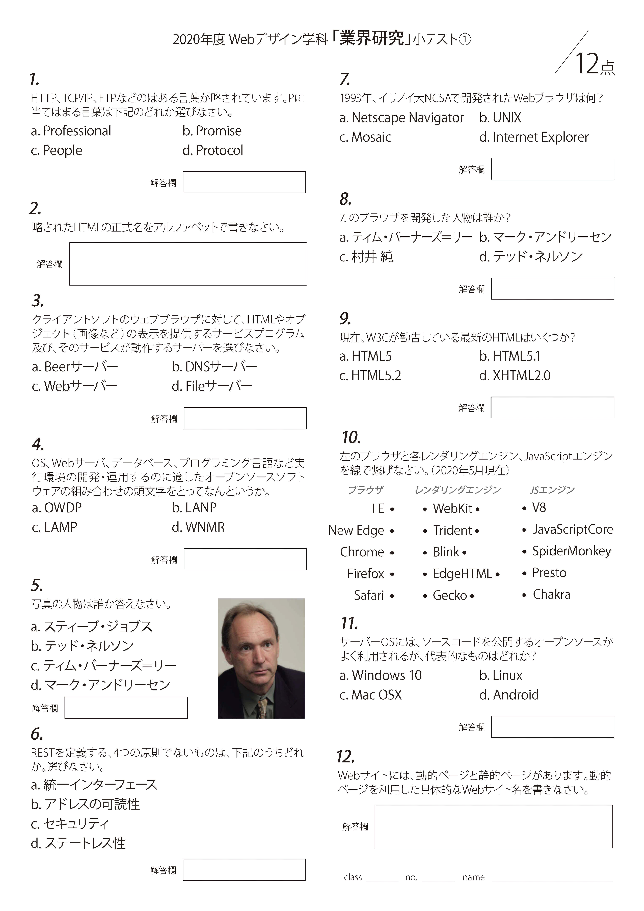

<h3 class="title is-5" >小テスト</h3>

 第1章「Web技術とは」から小テストを行います。  
 期末テストのために、紙の小テスト用紙を添付します。  
 画像を保存して、学期末までにプリントアウトしておきましょう。

 [業界研究小テスト](https://forms.gle/6rpPTJuXgJnYFv2P7)

<h3 class="title is-5">Webとネットワーク技術</h3>
<figure class="is-fullwidth slide">
  <iframe src="https://drive.google.com/file/d/1KdToknnTBKB1o9Yfe18mLfg7qKTzzSc6/preview"></iframe>
</figure>

<h3 class="title is-5">HTTP情報を使ったワンクリック詐欺体験</h3>

[にせワンクリック詐欺](https://nisesagi.com/cyvercrime/niseoneclick/)

<h3 class="title is-5" >授業録画</h3>

オンライン授業を試験的に録画してあります。  
編集して限定公開しますので、授業後の復習に活用してください。  
倍速は1.5倍までは、聞き取れると思います。

<figure class="is-fullwidth movie">
<iframe width="560" height="315" src="https://www.youtube.com/embed/LI9Et8wDYYc" frameborder="0" allow="accelerometer; autoplay; encrypted-media; gyroscope; picture-in-picture" allowfullscreen></iframe>
</figure>

<h4 class="title is-6">補足</h4>

+ すみません。W3CとWHATWGのHTML策定合意は、1年前の2019年5月28日付け（[Memorandum of Understanding Between W3C and WHATWG](https://www.w3.org/blog/news/archives/7753)）でしたが、今後のHTMLは、「WHATWG Living Standard」が公式の仕様書となるのは変わりません。
+ 現在、W3Cに記載されているHTML5.3は、削除予定です。[HTML標準仕様の策定についてW3CとWHATWGが合意... - ITmedia NEWS](https://www.itmedia.co.jp/news/articles/1906/10/news038.html)
 

