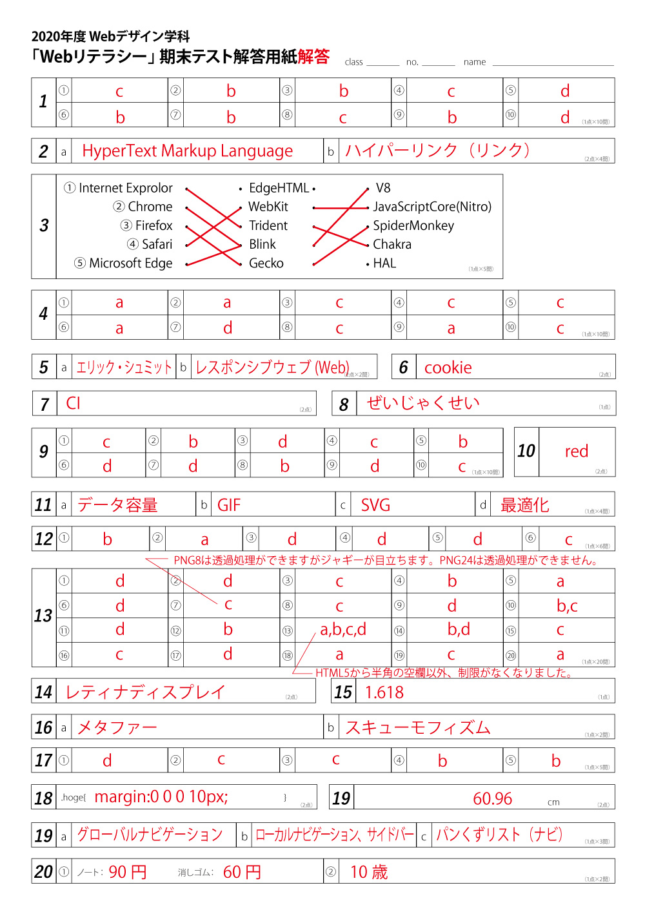

<h3 class="title is-5">2020年度前期「業界研究」期末テスト</h3>

期末テストの解答を貼っておきます。

<h4 class="title is-6">問13の⑦</h4>

問題があまり良くありませんでした。  
PNG24は透過できず、PNG8は透過できるのですがジャギーが目立ってしまうので実用的ではありません。  
PNG32必要でした。  
__全員正解にします。__

<h4 class="title is-6">問13の⑬</h4>

こちらも確認不足でした。
HTML4、XHTML1.1までは、制限があったのですが、HTML5から文字種の制限がなくなりました。  
勉強不足でした。  
__全員正解にします。__

<h4 class="title is-6">過去の期末テスト</h4>
Googleで「トライデント 期末テスト」で検索すると過去の期末テストがそのまま紹介されています。

