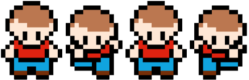

<div class="post-section">
<h3 class="title is-5" >小テスト</h3>

[JavaScript演習小テスト⑨](https://forms.gle/Zo4rYX2UKxdS1DEN9)

スマートスクロールするナビゲーションを作りましょう。
</div>


<div class="post-section">
<h3 class="title is-5" >前回の課題</h3>

パララックスエフェクトを使って、作品を制作してください。
</div>

<div class="post-section">
<h3 class="title is-5" >画像を入れ替えてアニメーション</h3>

CSSスプライトとCSSアニメーションを利用して画像を高速で入れ替えることで、  
滑らかなアニメーションを表現します。

参考：[KEY OF FUTURE | 三菱商事プラスチック株式会社](https://www.mcplas.co.jp/keyoffuture/)



```javascript
<div class="chara"></div>
```
```css
.chara {
    background: url(run.png) no-repeat;
    width: 124px;
    height: 160px;
    animation: run 1s steps(4) infinite;
}

@keyframes run {
    to {
        background-position: -496px 0;
    }
}
```
参考：[CSSスプライトとstepsを使ってアニメーション画像を作ろう |  Webクリエイターボックス](https://www.webcreatorbox.com/tech/css-sprite-steps)

</div>

<div class="post-section">
<h3 class="title is-5" >マウスストーカー</h3>

「マウスストーカー」と検索するとたくさん記事が出てきますので、細かい部分はそちらも参考にしてください。

- マウスの位置を取得
- マウスの位置へアニメーションする要素
- CSSスプライトアニメーションとの連携


<h4 class="title is-6" >mousemoveイベント</h4>

mousemove イベントは、マウスなどのポインティングデバイスで、  
カーソルのホットスポットが要素内にある間に動いた時に発生するイベントです。

```javascript
window.addEventListener('mousemove', function(e) {
    console.log(e.clientX, e.clientY);
});
```

カーソルになる``<div id="cursor">``とマウスストーカーになる``<div id="stalker">``を準備します。  
それぞれCSSで整えます。

```javascript
<div id="cursor"></div>
<div id="stalker"></div>
```

```css
body {
    position: relative;
    cursor: none;
}
#cursor {
    position: fixed;
    width: 12px;
    height: 12px;
    top: -6px;
    left: -6px; /*半分引いてカーソル先端に画像中心位置が来るように*/
    border-radius: 50%;
    z-index: 3;
    pointer-events: none;/*【重要】マウス直下に常に要素があるので、全てをクリックできなくなる。この要素に対してnoneにすることで対応する。*/
    background-color: #000;
    opacity: 0; /*開いた瞬間非表示*/
}
#stalker {
    position: fixed;
    width: 60px;
    height: 60px;
    top:-30px;
    left:-30px;
    border-radius: 50%;
    z-index: 2;
    pointer-events: none;
    background-color: gray;
    opacity: 0; 
}
```

取得したマウスの位置を``<div id="cursor"></div>``に反映させる。  
``top,left``でもいいが、translateの方が速いらしいので。  
[参考:Webアニメーションを高速化するために知っておくべき10のこと（前編）](https://html5experts.jp/cssradar/2027/)

```javascript
let cursor = document.querySelector('#cursor');
window.addEventListener('mousemove', function(e) {
    cursor.style.transform = 'translate(' + e.clientX + 'px, ' + e.clientY + 'px)';
});
```

これで、マウスの位置にcursor要素が着いてきます。  
遅れてstalker要素が着いてくるようにします。

```css
transition: transform 0.3s ease-out;
```
```javascript
stalker.style.transform = 'translate(' + e.clientX + 'px, ' + e.clientY + 'px)';
```
だけど、少しストーカーの動きがぎこちないので、上記を削除してsetTimeoutを使います。

<h4 class="title is-6" >setTimeout()</h4>

[WindowOrWorkerGlobalScope.setTimeout()](https://developer.mozilla.org/ja/docs/Web/API/WindowOrWorkerGlobalScope/setTimeout)

setTimeout() は WindowOrWorkerGlobalScope ミックスインのメソッド (および Window.setTimeout() の後継) で、  
時間切れになると関数または指定されたコードの断片を実行するタイマーを設定します。

```javascript
window.addEventListener('mousemove', function(e) {
cursor.style.transform = 'translate(' + e.clientX + 'px, ' + e.clientY + 'px)';

//setTimeoutで100ミリ秒遅らせる。
setTimeout(function() {
    stalker.style.transform = 'translate(' + e.clientX + 'px, ' + e.clientY + 'px)';
}, 100);

});
```
</div>

<div class="post-section">
<h3 class="title is-5" >組み合わせる</h3>

```javascript
<div id="stalker" class="chara"></div>
```

```css
 /*ストーカー要素*/
#stalker {
    position: fixed;
    z-index: 2;
    /*一番手前に来るように*/
    pointer-events: none;
    /*【重要】マウス直下に常に画像があるので、全てをクリックできなくなる。noneにして対応*/
    transition: transform 2s ease-out;
}

.chara {
    background: url(run.png) no-repeat;
    width: 124px;
    height: 160px;
    animation: run 1s steps(4) infinite;
}

@keyframes run {
    to {
        background-position: -496px 0;
    }
}
```

マウスの動いた方向を検知して、画像を変更することも可能です。

</div>