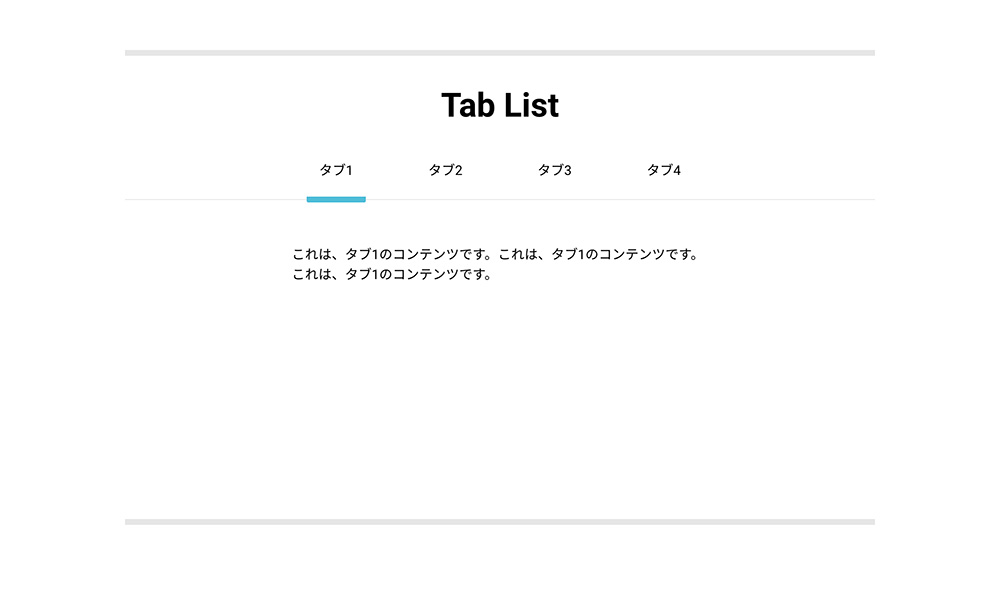

<div class="post-section">
<h3 class="title is-5" >小テスト</h3>

[JavaScript演習小テスト⑬](https://forms.gle/7nzUHmSykoNFZnTWA)

上記に小テスト記載のリポジトリからクローンしたデータから、編集してGoogleフォームで送ってください。
</div>


<div class="post-section">
<h3 class="title is-5">フレームワーク</h3>

前回から、JavaScriptフレームワークVUe.jsを利用しています。  
Webサイトに盛り込めるUIパーツの作成方法を紹介していきます。

<h3 class="title is-5">フォーム入力バインディング</h3>

``v-model``は、内部的にはinput要素に応じて異なるプロパティを使用し、異なるイベントを送出します。

```js:title=vue.html
<input v-model="message" placeholder="edit me">
<p>Message is: {{ message }}</p>
```
```js
new Vue({
    el: '#app',
    data: {
        ...中略...
        message: ''
    }
})
```
このようなformを見たことがあると思います。  
JavaScript内でバインディング（同期）しているので、入力した値も即、反映させることができます。

<h3 class="title is-5">タブパネル</h3>

タブをクリックして切り替えることで表示させるコンテンツが変わるタブパネルを作ってみましょう。



<h4 class="title is-6">準備</h4>

```js:title=vue3.html
<!DOCTYPE html>
<html lang="ja">
<head>
    <meta charset="UTF-8">
    <title>タブパネル</title>
    <link rel="stylesheet" href="https://cdn.rawgit.com/filipelinhares/ress/master/dist/ress.min.css">
    <link rel="stylesheet" href="css/base.css">
    <style>
    </style>
</head>
<body>
    <div id="app">

        <div id="wrapper">
            <h1>Tab List</h1>
            <div id="tab">
                <div class="tab-list">
                    <button>タブ1</button>
                </div>
                <div class="tab-list">
                    <button>タブ2</button>
                </div>
                <div class="tab-list">
                    <button>タブ3</button>
                </div>
            </div>
            <div id="content">
                これは、タブ1のコンテンツです。これは、タブ1のコンテンツです。これは、タブ1のコンテンツです。
            </div>
        </div>
    </div>
    <script src="https://cdn.jsdelivr.net/npm/vue/dist/vue.js"></script>
    <script>
    </script>
</body>
</html>
```

```css:title=base.css
@import url("https://fonts.googleapis.com/css?family=Noto+Sans+JP:400|Roboto:400,700&display=swap");

body {
  font-family: 'Roboto', 'Noto Sans JP', sans-serif;
  -webkit-font-smoothing: antialiased;
  font-size: 14px;
  line-height: 1.5;
  color: #000;
  background: white;
}

*:focus {
  outline: none !important;
}

#wrapper {
  padding: 30px 0;
  margin: 30px 30px;
  border-top: 7px solid #E6E6E6;
  border-bottom: 7px solid #E6E6E6;
}

#wrapper h1 {
  font-size: 30px;
  text-align: center;
  margin: 0;
}

#tab {
  display: flex;
  width: 100%;
  justify-content: center;
  padding: 0;
  margin: 15px 0 0 0;
  position: relative;
}

#tab:before {
  content: '';
  display: block;
  width: 100%;
  height: 1px;
  border-bottom: 1px solid #e6e6e6;
  position: absolute;
  left: 0;
  bottom: 3px;
}

#tab .tab-list {
  margin: 0 10px;
}

#tab .tab-list.-active button {
  border-bottom: 7px solid #50BDD8;
}

#tab button {
  position: relative;
  background: none;
  border: none;
  padding: 20px 15px;
  text-align: center;
  cursor: pointer;
}

#content {
  display: flex;
  width: 100%;
  margin: 30px 0 0 0;
}

@media screen and (min-width: 768px) {
  body {
    font-size: 16px;
    padding: 0 30px;
  }

  #wrapper {
    max-width: 900px;
    margin: 60px auto;
    padding: 30px 0;
  }

  #wrapper h1 {
    font-size: 40px;
  }

  #tab .tab-list {
    margin: 0 30px;
  }

  #content {
    max-width: 500px;
    min-height: 300px;
    margin: 50px auto 0;
  }
}
```

<h4 class="title is-6">Vue.jsの操作</h4>

タブリストのデータを配列tabsとして、Vueインスタンス内のdata内に追加していきましょう。  
タブリストに表示する名前、クリックした時に表示されるコンテンツを含めます。  
v-forでkey属性に設定するidも含めます。

```js
<script>
new Vue({
    el: '#app',
    data: {
        //タブ情報を定義する。
        tabs: [
            {
                id: 1,
                name: 'タブ1',
                content: 'これは、タブ1のコンテンツです。これは、タブ1のコンテンツです。これは、タブ1のコンテンツです。'
            },
            {
                id: 2,
                name: 'タブ2',
                content: 'これは、タブ2のコンテンツです。これは、タブ2のコンテンツです。これは、タブ2のコンテンツです。'
            },
            {
                id: 3,
                name: 'タブ3',
                content: 'これは、タブ3のコンテンツです。これは、タブ3のコンテンツです。これは、タブ3のコンテンツです。'
            },
            {
                id: 4,
                name: 'タブ4',
                content: 'これは、タブ4のコンテンツです。これは、タブ4のコンテンツです。これは、タブ4のコンテンツです。'
            },
        ]
    }
})
</script>
```

v-forディレクティブを使用してタブリストを表示します。  
現在、あるタブ2、タブ3、タブ4は削除します。  
key属性にはtab.idを指定します。

```js
<div id="app">
    <div id="wrapper">
        <h1>Tab List</h1>
        <div id="tab">
            <div v-for="(tab,index) in tabs" v-bind:key="tab.id" class="tab-list">
                <button>{{ tab.name }}</button>
            </div>
        </div>
        <div id="content">
            これは、タブ1のコンテンツです。これは、タブ1のコンテンツです。これは、タブ1のコンテンツです。
        </div>
    </div>
</div>
```

開いているタブのコンテンツを表示させます。  
まず、現在開いているタブはどれか？という情報をdataに持たせます。  
その情報をtabindexとします。  
このtabindexには、現在開いているtabデータのtabs配列内でのindexを持たせます。  
初期値は0にします。

```js
new Vue({
    el: '#app',
    data: {
        //現在、開いているタブのインデックス
        tabindex: 0,
        //タブ情報を定義する。
        tabs: [{
                id: 1,
                name: 'タブ1',
                content: 'これは、タブ1のコンテンツです。これは、タブ1のコンテンツです。これは、タブ1のコンテンツです。'
            }...
        ]
    }
})
```
</div>

<div class="post-section">
<h3 class="title is-5" >computedオプション</h3>

computedオプションは算出プロパティを登録するためのオプションです。  
算出プロパティはdataオプションに登録したデータを用いて算出したデータのことを指します。  
※computedは、__計算する、算出する__の意味です。

例えば、data内の配列の要素数を返すtabLengthという算出プロパティを登録するには次のようになります。

```js
new Vue({
    el:'#app',
    data:{
        tabs:[{...中略...}]
    },
    computed:{
        tabLength : function(){
            return this.tabs.length
        }
    }
})
```

任意の場所に入れる。

```js:title="vue3.html"
<p>{{ tabLength }}</p>
```

実は、methodsオプションでも同じことができます。  
ただ、dataオプションデータを用いて別データを算出したい場合は、computedオプションを使います。  
算出プロパティはリアクティブな依存関係にもとづきキャッシュされるという違いがあり、算出プロパティは、リアクティブな依存関係が更新されたときにだけ再評価されます。  
これはつまり、元の値が変わらなければ、関数を再び実行することなく以前計算された結果を即時に返すということです。  

computedオプションを利用します。

```js
computed: {
    tabContent() {
        return this.tabs[this.tabindex].content
    }
}
```

```js:title=vue3.html
<tab id="content">
    {{ tabContent }}
</tab>
```

</div>

<div class="post-section">
<h3 class="title is-5" >methodsオプション</h3>

それぞれのタブボタンをクリックすると、コンテンツが切り替わる処理を記述していきます。  
クリックしたタブのtabs配列内でのインデックスをtabindexに代入する処理を、関数tabClickとしてmethods内に記述します。

```js
methods: {
    tabClick(index) {
        this.tabindex = index
    }
}
```

v-on:でクリックイベントにtabClickメソッドを指定します。  
同時に選択中かどうかわかりやすくするために、-activeクラスをタブリストに追加するようにも記述します。

```js
<div id="tab">
    <div v-for="(tab,index) in tabs" v-bind:key="tab.id" class="tab-list" 
    v-on:click="tabClick(index)"
    v-bind:class="{'-active':index === tabindex}">
        <button>{{ tab.name }}</button>
    </div>
</div>
```

これで、タブパネルの動きができました。

続いて、[モーダル](/javascript/post-14_2)を作成してみましょう。
</div>