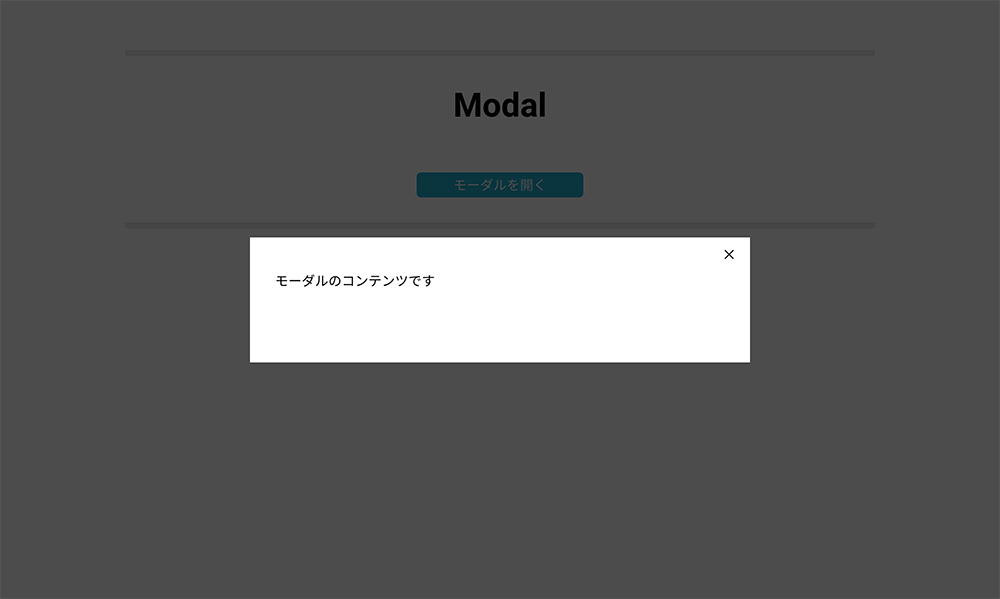

<div class="post-section">

<h3 class="title is-5">モーダル</h3>

画面を覆うように表示されるモーダルウィンドウを作りましょう。  
×ボタン、もしくはモーダル外をクリックすると閉じることができます。



<h4 class="title is-6">準備</h4>

```js:title=vue3.html
<!DOCTYPE html>
<html lang="ja">
<head>
    <meta charset="UTF-8">
    <title>モーダル</title>
    <link rel="stylesheet" href="https://cdn.rawgit.com/filipelinhares/ress/master/dist/ress.min.css">
    <link rel="stylesheet" href="css/base2.css">
</head>
<body>
    <div id="app">
        <div id="wrapper">
            <h1>Modal</h1>
            <button id="modal-open-btn">
                モーダルを開く
            </button>
            <div class="modal-overlay">
                <div id="modal">
                    <button id="modal-close-btn">
                        ✕
                    </button>
                    <div id="modal-content">
                        <p>モーダルのコンテンツです</p>
                    </div>
                </div>
            </div>
        </div>
    </div>
    <script src="https://cdn.jsdelivr.net/npm/vue/dist/vue.js"></script>
    <script>
    </script>
</body>
</html>
```

```css:title=base2.css
@import url("https://fonts.googleapis.com/css?family=Noto+Sans+JP:400|Roboto:400,700&display=swap");

body {
    font-family: 'Roboto', 'Noto Sans JP', sans-serif;
    -webkit-font-smoothing: antialiased;
    font-size: 14px;
    line-height: 1.5;
    color: #000;
    background: white;
}

*:focus {
    outline: none !important;
}

#wrapper {
    padding: 30px 0;
    margin: 30px 30px;
    border-top: 7px solid #E6E6E6;
    border-bottom: 7px solid #E6E6E6;
}

#wrapper h1 {
    font-size: 30px;
    text-align: center;
    margin: 0;
}

#modal-open-btn {
    width: 200px;
    margin: 30px 0 0 0;
}

.modal-overlay {
    position: fixed;
    top: 0;
    left: 0;
    justify-content: center;
    align-items: center;
    display: flex;
    width: 100vw;
    height: 100vh;
    background: rgba(0, 0, 0, 0.7);
}

#modal {
    position: relative;
    width: 50%;
    background: white;
}

#modal-close-btn {
    position: absolute;
    right: 0;
    display: flex;
    flex-direction: column;
    justify-content: center;
    align-items: center;
    margin: 5px 10px;
    width: 30px;
    height: 30px;
    padding: 0;
    cursor: pointer;
    outline: none;
    border: none;
    background: none;
}

#modal #modal-content {
    min-height: 150px;
    padding: 40px 30px;
}

@media screen and (min-width: 768px) {
    body {
        font-size: 16px;
        padding: 0 30px;
    }

    #wrapper {
        max-width: 900px;
        min-height: 200px;
        margin: 60px auto;
        padding: 30px 0;
    }

    #wrapper h1 {
        font-size: 40px;
    }

    #modal-open-btn {
        display: flex;
        width: 200px;
        justify-content: center;
        margin: 50px auto 0;
        line-height: 30px;
        padding: 0;
        border: none;
        background: #1AAED3;
        color: #fff;
        border-radius: 5px;
        cursor: pointer;
    }
}

.fade-enter-active,
.fade-leave-active {
    /** opacityを0.3秒かけてアニメーションさせる **/
    transition: opacity .3s;
}

.fade-enter,
.fade-leave-to {
    opacity: 0;
}
```

<h4 class="title is-6">Vue.jsの操作</h4>

モーダルが表示されたままですので、非表示にします。  
また、isModalというフラグをdata内に追加してfalseに設定しておきます。

```js:title=vue4.html
<div v-if="isModal" class="modal-overlay">
```
```js
<script>
    new Vue({
        el: '#app',
        data: {
            //フラグを追加する。
            isModal: false,
        }
    })
</script>
```

isModalがfalseになっていますので、
v-ifディレクティブが設定されている要素（モーダル）が非表示なります。  
もう一度、trueにしてみて表示されていれば、v-ifが働いています。


<h4 class="title is-6">モーダルの表示・非表示</h4>

このフラグボタンをクリックで切り替えられるようにしましょう。
モーダルを開くopenModal()、モーダルを閉じるcloseModal()をmethods内に追加します。

```js
new Vue({
    el: '#app',
    data: {
        //フラグを追加する。
        isModal: true,
    },
    methods: {
        //モーダルを開く
        openModal() {
            this.isModal = true
        },
        //モーダルを閉じる
        closeModal() {
            this.isModal = false
        }
    }
})
```

htmlにイベントの属性を設定します。

```js
<div id="app">
<div id="wrapper">
    <h1>Modal</h1>
    <!-- モーダルが開くためのイベント-->
    <button id="modal-open-btn" v-on:click="openModal">
        モーダルを開く
    </button>
    <div v-if="isModal" class="modal-overlay">
        <div id="modal">
            <!-- モーダルが閉じるためのイベント-->
            <button id="modal-close-btn" v-on:click="closeModal">
                ✕
            </button>
            <div id="modal-content">
                <p>モーダルのコンテンツです</p>
            </div>
        </div>
    </div>
</div>
</div>
```

``<button></button>``や``<a></a>``は、その要素のデフォルトのイベント「buttonは送信」「aはリンクに飛ぶ」が発生するので、イベントオブジェクトeventを引数に取り、event.preventDefault()を呼び出します。

```js
methods: {
        //モーダルを開く
        openModal(event) {
            event.preventDefault()
            this.isModal = true
        },
        //モーダルを閉じる
        closeModal(event) {
            event.preventDefault()
            this.isModal = false
        }
    }
```

event.preventDefaultは、イベント処理でよく使われるので、Vue.jsでは、より簡単に実行するための方法が用意されています。  
.preventは、イベント修飾子とよばれるものの1つで、v-onディレクティブとセットで使います。  
使い方は、v-onディレクティブの後ろ``v-on:submit.prevent="openModal"``という感じで使います。  
今回は、親要素へのイベントの伝播を防ぐために、.prevent.stopを使います。

```js
<!-- モーダルが開くためのイベント-->
<button id="modal-open-btn" v-on:click.prevent.stop="openModal">

<!-- モーダルが閉じるためのイベント-->
<button id="modal-close-btn" v-on:click.prevent.stop="closeModal">

```

</div>

<div class="post-section">
<h3 class="title is-5" >mounted関数</h3>

さらに、モーダル外をクリックした時にモーダルを閉じられるようにします。  
処理を作るには、このページのどこをクリックした時に、クリックした場所がモーダル外かを判定します。  
その判定する処理をmounted()関数内に書きます。

mounted()関数は、Vueアプリ内のHTMLが表示されたあとに呼び出される特別な関数です。  
methodsオプション内に定義された関数とは違い、mounted()は、Vue.jsから自動的に呼び出される仕組みになっています。

```js
new Vue({
    ...中略...
    mounted() {
        //Vueアプリ内のHTMLが表示されたあとによばれる
        document.addEventListener('click', function(e) {

        })
    },
})
```

クリックした要素は、クリックイベントのイベントリスナーの引数eventのevent.targetで取得できます。  
このevent.targetが持つclosest()という関数を使い、引数に#modalを設定することで、実行した要素（event.target）の親要素の中から(#modalを)検索するという関数です。  
一致するものがなければnullを返します。

[Element.closest()](https://developer.mozilla.org/ja/docs/Web/API/Element/closest)
>closest() メソッドは、要素とその親 (文書ルートに向かって) を、指定されたセレクター文字列に一致するノードが見つかるまで探索します。自分自身または一致する祖先を返します。  
>そのような要素が存在しない場合は、 null を返します。

返ってきた値が、nullであれば、モーダル外でのクリックで、そうでなければモーダル内でのクリックと判定ができます。  
これを利用して、__モーダルが開いている時__かつ__モーダル外でクリックされた時__にモーダルを閉じるという関数を書きましょう。

```js
mounted() {
    //thisはクリックイベント時には、そのクリックされた要素にかかるので、事前にVueインスタンスのthisを変数_thisに代入して横に置いておく。
    let _this = this
    //Vueアプリ内のHTMLが表示されたあとによばれる
    document.addEventListener('click', function(event) {
        //クリックしたものが#modalを持っている要素の場合、それを取得する。
        let target = event.target.closest('#modal')
        console.log(_this.isModal, target === null, _this)
        if (_this.isModal && target === null) {
            _this.closeModal()
        }
    })
},
```

</div>

<div class="post-section">
<h3 class="title is-5">&lt;transition&gt;コンポーネントでアニメーション</h3>

Vue.jsには、``<transition>``というコンポーネントが標準で用意されています。

<h4 class="title is-6">コンポーネントとは</h4>

コンポーネントとは、複数のアプリで再利用可能なインスタンスです。  
コンポーネントはHTMLの部品のようなもので、呼び出すことでコンポーネント内に登録されたHTML要素を表示することができます。  
また、Vueのインスタンスでもあるので、data mothodsなどのVueのオプションもその中に含まれます。  
``<transiton>``コンポーネントは、v-if, v-showによる要素の表示の切り替えに合わせたアニメーションを簡単に追加できるというコンポーネントです。  
※v-ifはDOMが削除されたり作成されたりしますが、v-showは、CSS上で表示・非表示が切り替わります。

すでに、v-ifディレクティブが設置されていますので、特に変更する必要はありません。

```js:title=vue4.html
<!-- <transiton>でモーダルを囲む-->
<transition name="fade">
    <div v-if="isModal" class="modal-overlay">
        <div id="modal">
            <!-- モーダルが閉じるためのイベント-->
            <button id="modal-close-btn" v-on:click.prevent.stop="closeModal">
                ✕
            </button>
            <div id="modal-content">
                <p>モーダルのコンテンツです</p>
            </div>
        </div>
    </div>
</transition>
```

``<transition>``コンポーネントには、name属性を設定できます。  
また、「トランジションクラス」とよばれる特殊なクラスが``<transition>``コンポーネントの子要素の表示時・非表示時に自動で設定されます。  
この「トランジションクラス」に対してCSSを書くことで、アニメーションを適用させるという使い方になります。  
トランジションクラスには、いくつかあります。

<table class="table is-bordered is-striped is-narrow">
<thead>
<tr>
<td>クラス名</td>
<td>タイミング</td>
</tr>
</thead>
<tbody>
<tr>
<td>&nbsp;.v-enter</td>
<td>&nbsp;Enter開始（要素が追加される前）</td>
</tr>
<tr>
<td>&nbsp;.v-enter-active&nbsp;</td>
<td>&nbsp;Enter開始後に実行されている間 （要素が追加されている間）</td>
</tr>
<tr>
<td>&nbsp;.v-enter-to</td>
<td>&nbsp;Enter完了（要素が追加された時）</td>
</tr>
<tr>
<td>&nbsp;.v-leave</td>
<td>&nbsp;Leave開始（要素が削除される前）</td>
</tr>
<tr>
<td>&nbsp;.v-leave-active</td>
<td>&nbsp;Leave開始後に実行されている間&nbsp;（要素が削除されている間）</td>
</tr>
<tr>
<td>&nbsp;.v-leave-to</td>
<td>&nbsp;Leave完了（要素が削除された時）</td>
</tr>
</tbody>
</table>

v-は、name属性で設定した値になります。  
今回は、fadeという値になります。　　
style要素で書いてしまいましょう。

```css:title=vue4.html
<style>
.fade-enter-active,
.fade-leave-active {
    /** opacityを0.3秒かけてアニメーションさせる **/
    transition: opacity .3s;
}

.fade-enter,
.fade-leave-to {
    opacity: 0;
}
</style>
```

これでモーダルウィンドウが作成できました。

「タブパネル」「モーダル」は、__初心者からちゃんとしたプロになる JavaScript基礎入門__の題材を少しカスタマイズして、紹介しました。

<a href="https://www.amazon.co.jp/dp/4844369644/"></a>

ただし、基本部分は、教科書「これから学ぶJavaScript」に記述されているもので十分です。
</div>

<div class="post-section">
<h3 class="title is-5">JavaScriptの勉強</h3>

フロントエンドの勉強をしていくと、現在はフレームワークの話題がたくさん出てきます。  
これからも新しいフレームワークが出てくると思います。  
それらを触るには、やはり__変数、イベント、分岐、ループ、演算子、配列、オブジェクト__などが必要になります。  
jQueryを使うなどPure.jsにこだわる必要はありませんが、上記の基本は意識して使えると、これからの新技術にも対応できる土台となるでしょう。

</div>