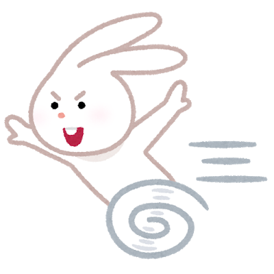

<div class="post-section">
<h3 class="title is-5" >小テスト</h3>

[JavaScript演習小テスト①](https://forms.gle/EJkknSmLMKBrT7YQ6)
<p>jQeryを使ってみよう。</p>
</div>

<div class="post-section">
<h3 class="title is-5" >Form</h3>
<figure class="is-fullwidth slide">
  <iframe src="https://drive.google.com/file/d/1O6E4NO2gVYbaW1okOD_AmvG8nhzeeM9z/preview"></iframe>
</figure>
</div>
<div class="post-section">
<h3 class="title is-5" >formからの値取得</h3>

```javascript
<!DOCTYPE html>
<html lang="ja">
<head>
    <meta charset="UTF-8">
    <title>form1</title>
</head>
<body>
<form id="trident">
    <input type="text" name="school" value="トライデント" id="school">
</form>
<button>送信</button>
<p id="result"></p>
<script>
let submitBtn = document.querySelector("button");
submitBtn.addEventListener('click', function() {
    let val = document.forms[0].school.value;
    let result = document.querySelector("#result");
    result.textContent = val;
})
</script>
</body>
</html>
```

<h4 class="title is-6" >jQueryで書くと</h4>

```javascript
$('button').on('click', function() {
    $('#result').html($('#school').val());
});
```
</div>
<div class="post-section">
<h3 class="title is-5" >計算させてみる</h3>

```javascript
<form>
    <input type="number" name="number1" class="val_1">
    <input type="number" name="number2" class="val_2">
</form>
<button>計算する</button>
<script>
let ansBtn = document.querySelector('button');
ansBtn.addEventListener('click', function() {
    let Num1 = document.forms[0].number1.value;
    let Num2 = document.forms[0].number2.value;
    console.log(parseInt(Num1) + parseInt(Num2));
})
</script>
```
<h4 class="title is-6" >jQueryで書くと</h4>

```javascript
$('button').on('click', function() {
    console.log(parseInt($('.val_1').val()) + parseInt($('.val_2').val()))
});
```
</div>
<div class="post-section">
<h3 class="title is-5" >Formのイベント</h3>

```javascript
<form>
  <input type="text" value="トライデント" name="school">
  <input type="reset" name="reset">
  <button type="submit">送信する</button>
</form>
<script>
let form = document.forms[0];
let submitBtn = document.querySelector('button');
let schoolarea = document.querySelector('input[name="school"]');
//blur, change, select, input
schoolarea.addEventListener('blur', function() {
   console.log('イベントが発動しました。');
});
//submit, resetはformにイベントを設定
form.addEventListener('submit', function() {
    alert('送信されました。');
});
</script>
```

<h4 class="title is-6" >jQueryで書くと</h4>

```javascript
$('[name="school"]').on('focus', function() {
    console.log('イベントが発動しました。');
})
$('form').on('reset',function(){
    alert('リセットされました。')
})
```
</div>
<div class="post-section">
<h3 class="title is-5" >取得した値を.styleで反映する</h3>

```javascript
<style>
img {
   width: 300px;
   display: block;
   margin: 0 auto;
}
form {
   text-align: center;
}
</style>

<form>
    <input type="range" min="-100" max="100" name="rabbit">
</form>
<script>
let rangeForm = document.querySelector('[name="rabbit"]')
let rabbit = document.querySelector('#rabbitImg');
rangeForm.addEventListener('input', function() {
    rabbit.style.transform = 'translateX(' + rangeForm.value + 'px)';
});
</script>
```


<h4 class="title is-6" >縦（Y軸）の動きを加えてみる</h4>

```javascript
<form>
<label>左右<input type="range" min="-100" max="100" name="rabbit_1" class="leftright"></label>
<label>上下<input type="range" min="-100" max="100" name="rabbit_2" class="topbottom"></label>
</form>
<script>
let sideRange = document.querySelector('.leftright');
let vertiRange = document.querySelector('.topbottom');
let rabbit = document.querySelector('#rabbitImg');
let formvalue = document.forms[0];
//それぞれのinput要素にイベントを設定
for (let i = 0; i < formvalue.length; i++) {
  formvalue[i].addEventListener('input', function() {
    rabbit.style.transform = 'translate(' + sideRange.value + 'px,' + vertiRange.value + 'px)';
  });
}
</script>
```
<h4 class="title is-6" >jQueryで書くと</h4>

```javascript
//jQueryだとループさせなくても、それぞれにイベントが設定できる。
$('form input').on('input', function() {
    let leftright = $('.leftright').val();
    let topbottom = $('.topbottom').val();
    $('#rabbitImg').css({
        'transform': 'translate(' + leftright + 'px,' + topbottom + 'px)',
    })
})
```

</div>
<div class="post-section">
<h3 class="title is-5" >【宿題】CSSで操作できる作品を作ってみよう</h3>

input type="range"の値を使って、CSSで操作できる作品を作ってください。

+ 「数値を使うCSSのプロパティ」は何があるかを話し合ってみる。
+ input type ="range"の数は自由
+ jQueryのメソッド、.css()を利用してもOKです。
+ 画像を使用するしないも自由。使用する場合、著作権注意。
+ 常に作品として公開しても良いように、題材・表現の仕方に注意。
+ 5月18日（月）3時限目に発表
</div>

<h3 class="title is-5" >授業録画</h3>

オンライン授業を試験的に録画してあります。  
編集して限定公開しますので、授業後の復習に活用してください。  
倍速は1.5倍までは、聞き取れると思います。

<figure class="is-fullwidth movie">
<iframe width="560" height="315" src="https://www.youtube.com/embed/lJJ6a2B06is" frameborder="0" allow="accelerometer; autoplay; encrypted-media; gyroscope; picture-in-picture" allowfullscreen></iframe>
</figure>

<h4 class="title is-6">補足</h4>

+ `document.forms[0];`で取得しているのは、`<label> ~ </label>` になります。`<input/>`と関連づけられているのでinputのイベントが効きます。
 </div>