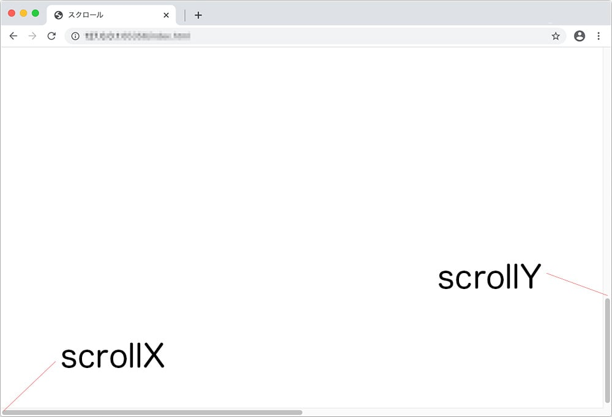

<div class="post-section">
<h3 class="title is-5" >小テスト</h3>

[JavaScript演習小テスト⑦](https://forms.gle/D9vchoM4FKXyLFFM9)

&lt;video&gt;要素もJavaScriptで操作できます。  
今後、動画を扱う機会も増えていくと思いますので、知っておくと良いでしょう。
</div>

<div class="post-section">
<h3 class="title is-5" >YouTube API</h3>

先週の「YouTube API」を使ったカスタマイズを見せてください。

</div>


<div class="post-section">
<h3 class="title is-5" >スクロール</h3>
<h4 class="title is-6" >現在のスクロール位置を取得</h4>

[window.scrollY - Web API | MDN](https://developer.mozilla.org/ja/docs/Web/API/Window/scrollY)  
>Window インターフェイスの読み取り専用プロパティである scrollY は、文書が現在垂直方向にスクロールしているピクセル数を返します。  
>最近のブラウザーでは、この値はサブピクセル精度ですので、必ずしも整数であるとは限りません。  
>文書が水平方向にスクロールしているピクセル数は scrollX プロパティで取得できます。

```javascript
console.log(window.scrollX, window.scrollY);
//windowは、省略可能なので、console.log(scrollX, scrollY);でも取得できます。

//jQuery
console.log( $(window).scrollLeft(),$(window).scrollTop());
```
  


<h4 class="title is-6" >スクロール位置を操作</h4>

[window.scrollTo - Web API | MDN](https://developer.mozilla.org/ja/docs/Web/API/Window/scrollTo)  

>文書内の特定の座標までスクロールします。  
>window.scrollTo(x-coord,y-coord)  
>window.scrollTo(options)

```javascript
<style>
body {
    height: 2000px;
    width: 2000px;
}

button {
    position: fixed;
}
</style>
...
<button>スクロールを移動</button>
```
x（横）300px, y（縦）300pxに移動させるJavaScript

```javascript
let Btn = document.querySelector('button');
Btn.addEventListener('click', function() {
    window.scrollTo(300, 300);
})
```
- options : 三つのプロパティを持たせられるオブジェクト
    - top y-coord と同じです
    - left x-coord と同じです
    - behavior smooth（スムーズなアニメーションで特定の位置までスクロールします。）、 instant（アニメーションせずにすぐに特定の位置までスクロールします。）、 auto のうちどれか一つを含む文字列。初期値は auto です。

```javascript
window.scrollTo({
    top: 500,
    left: 500,
    behavior: "smooth"
});

//jQuery
$('button').on('click', function() {
    $('html, body').animate({
        scrollTop: 500,
        scrollLeft: 500
    }, 300, 'swing');
});
```

</div>

<div class="post-section">
<h3 class="title is-5" >スクロールイベント</h3>
<h4 class="title is-6" >スクロールされたら</h4>

scrollイベントは、ドキュメントビューまたは要素がスクロールされたときに発生します。

[Document: scroll event - Web APIs | MDN](https://developer.mozilla.org/en-US/docs/Web/API/Document/scroll_event)

```javascript
<style>
...
.result {
    position: fixed;
    top: 2em;
}
...
</style>
<p class="result"></p>
```

```javascript
document.addEventListener('scroll', function() {
    document.querySelector('.result').textContent = scrollY;
    console.log(window.scrollX, scrollY);
});

//jQuery
$(window).on("scroll", function() {
    $('.result').text($('html, body').scrollTop());
    console.log($(window).scrollLeft(), $(window).scrollTop());
});
```

<h4 class="title is-6" >もしも、scrollYが501以上だったら</h4>

scrollする毎に、scrollYの値を取得し判定します。  
500よりも大きいかったら、bodyの背景色を赤にします。

```javascript
document.addEventListener('scroll', function() {
    document.querySelector('.result').textContent = scrollY;
    console.log(window.scrollX, scrollY);
    if (scrollY > 500) {
        document.body.style.backgroundColor = 'red';
    } else {
        document.body.style.backgroundColor = 'white';
    }
});

//jQuery
$(window).on("scroll", function() {
    $('.result').text($('html, body').scrollTop());
    if ($('html, body').scrollTop() > 500) {
        $('body').css('background-color','red');
    } else {
        $('body').css('background-color','white');
    }
});
```

transitionを使用して、アニメーションさせます。  
JavaScriptもclassを付与させます。

```javascript
body {
    height: 2000px;
    width: 2000px;
    transition: all 1s ease-out;
}

body.red {
    background-color: red;
}
```

```javascript
document.addEventListener('scroll', function() {
    document.querySelector('.result').textContent = scrollY;
    console.log(window.scrollX, scrollY);
    if (scrollY > 500) {
        document.body.classList.add('red');
    } else {
        document.body.classList.remove('red');
    }
});

//jQuery
$(window).on("scroll", function() {
    $('.result').text($('html, body').scrollTop());
    if ($('html, body').scrollTop() > 500) {
        $('body').addClass('red');
    } else {
        $('body').removeClass('red');
    }
});
```
</div>

<div class="post-section">
<h3 class="title is-5" >スクロールを利用したWebサイトパーツ</h3>

Bootstrapの[サンプルデータ](https://getbootstrap.jp/docs/4.5/examples/)を利用して、スクロールを利用したWebサイトのパーツを設置してみましょう。

[「bootstrap-carousel」ダウンロード](https://drive.google.com/drive/folders/1f8jG8Rky-6vzR3f6bnqil_97N7DQBtNX?usp=sharing)


<h4 class="title is-6" >途中で残るナビゲーション</h4>

ナビゲーションがページのトップに来たら、そのまま残るようにする。
まずは、現在のナビゲーションTopの位置を取得し、スクロールの位置がその位置を越えたら、position:fixdするようにする。

[HTMLElement.offsetTop - Web API | MDN](https://developer.mozilla.org/ja/docs/Web/API/HTMLElement/offsetTop)

```javascript:title=script.js
'use strict';

window.addEventListener('DOMContentLoaded', function () {
    let navElm = document.querySelector('nav');
    let navTop = navElm.offsetTop;
    console.log(navTop);
});

//jQuery
$(function () {
    let navTop = $('nav').offset().top;
    console.log(navTop);
});
```

スクロールの位置と&lt;nav&gt;の位置を判定して、CSSで整えます。
```javascript:title=style.css
@charset "utf-8";

.navfix {
    position: fixed;
    top: 0;
    width: 100%;
    z-index: 10;
}
```

```javascript:title=script.js
window.addEventListener('scroll', function () {
    if (scrollY >= navTop) {
        navElm.classList.add('navfix');
    } else if (scrollY < navTop) {
        navElm.classList.remove('navfix')
    }
});

//jQuery
$(window).on('scroll', function () {
    if ($('html,body').scrollTop() >= navTop) {
        $('nav').addClass('navfix');
    } else if ($('html,body').scrollTop() < navTop) {
        $('nav').removeClass('navfix');
    }
});
```

<h4 class="title is-6" >CSS position:sticky;でもできる。</h4>

[Can I use position:sticky ?](https://caniuse.com/#search=sticky)

Safariでは、ベンダープレフィックスが必要ですが、利用できそうです。  
JavaScriptのイベントをコメントアウトして、CSSを書き込みます。

```javascript
header {
    position: -webkit-sticky;
    position: sticky;
    top: 0;
    z-index: 10;
}
```

参考：[position:sticky;について - Qiita](https://qiita.com/ari-chel/items/c1ede1f27a37129a7cbe)
</div>

<div class="post-section">

次回は、スクロールで画像が表示されたり、フェードインするようにします。  
また、パララックスもできたら紹介します。
</div>
