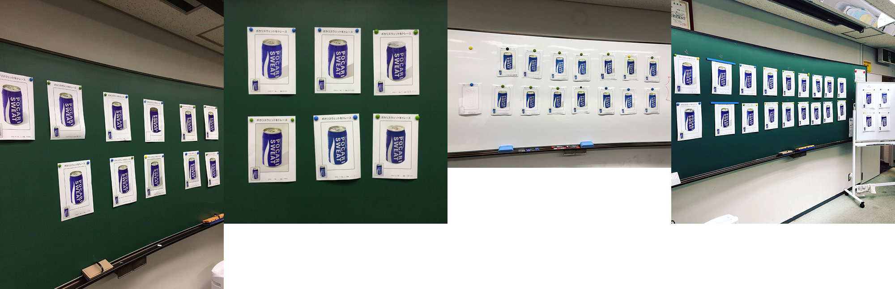
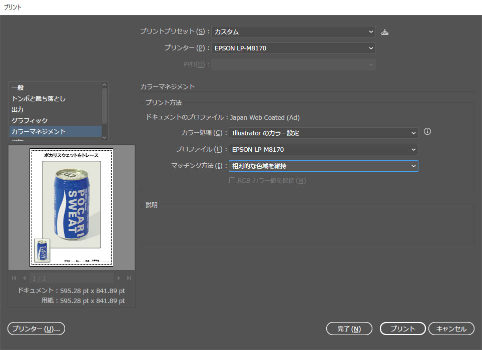

<h3 class="title is-5" >ポカリスウェットトレース</h3>
<figure class="is-fullwidth slide">
  <iframe src="https://drive.google.com/file/d/1nEKvFYIaO5EdseClHPWRbH19YHj9tsav/preview"></iframe>
</figure>

<h3 class="title is-5" >ポカリスウェット課題のねらい</h3>

1. ペンツールを使ってベクターツールの基本であるベジェ曲線を使いこなす。
1. レイヤーを複数にわけて、オブジェクトを整理しながら制作する。
1. カラーリングは単色ではなく、グラデーションを使用し、グラデーションバーの扱いに慣れる。
1. データの保存や複雑な操作を簡潔かつ正確にするため、ショートカットを駆使し、「左手」に覚えさせる。
1. 長時間の作業による根気と集中力を養う。

<h3 class="title is-5" >制作スケジュール</h3>

- 制作期間は4週間
- 7月7日（火）の1時限目に印刷。7月14日（火）に好評
- 6月23日（火）に中間確認

<h3 class="title is-5" >印刷設定</h3>

F74教室のプリンターは、初期設定のままだとちょっと青が明るく印刷されてしまいます。  
1. カラーマネジメント
1. プロファイルをF74教室のプリンタ「EPSON LP-M8170」に設定
1. マッチング方式は「相対的な色域を維持」のまま

</h3>