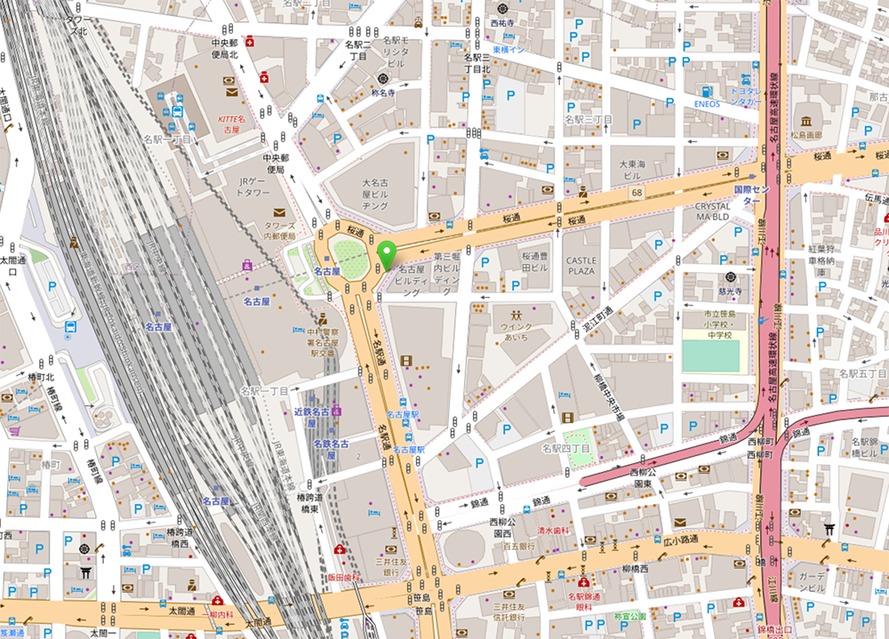

<h3 class="title is-5">アピアランス機能の解説</h3>

<figure class="is-fullwidth slide">
  <iframe src="https://drive.google.com/file/d/1S5wv7LYqbWA9m_TpIBTtaexulGHYvPwc/preview"></iframe>
</figure>

<h4 class="title is-6">Google Map使用の注意</h4>

[Googleマップ / Google Earth追加利用規約](https://www.google.com/intl/ja/help/terms_maps/)

__禁止行為。__本規定の第 2 条を遵守することが、Googleマップ/Google Earthの使用ライセンス付与の条件となります。Googleマップ / Google Earthの使用に際して、お客様（およびお客様の代理人）による以下の行為は禁止されています。

- Googleマップ / Google Earthの一部を再配布もしくは販売すること、または Googleマップ / Google Earthに基づいて新しい商品もしくはサービスを作成すること（ただし、利用規約に準拠してGoogle Maps / Google Earth APIを使用する場合を除く）。
- コンテンツをコピーすること（ただし、Googleマップ、Google Earth、ストリートビューの使い方と許可に関するガイダンスのページ、または適用される知的財産法で許可されている場合（これには「フェアユース」が含まれます）を除く）。
- コンテンツを大量にダウンロードすること、またはコンテンツの一括フィードを作成すること（もしくはその行為を第三者に委託すること）。
- Google マップ / Google Earthを使用して地図関連の別のデータセット（地図やナビゲーションのデータセット、ビジネス リスティングのデータベース、メーリング リスト、テレマーケティング リストを含む）を、Googleマップ / Google Earth に代わるまたはそれに類似するサービスで使用する目的で作成すること。
- またはGoogle マップ / Google Earthを第三者の商品やサービスで、またはリアルタイム ナビゲーションや自律的車両制御に関連して使用すること（Android Autoなど、Google が提供する機能を介する場合を除く）。

<h4 class="title is-6">トライデントのマップ作成</h4>

[OpenStreetMap](https://www.openstreetmap.org/directions?from=%E5%90%8D%E5%8F%A4%E5%B1%8B%E9%A7%85#map=17/35.17059/136.88422)

<h3 class="title is-5" >【課題】地元のおすすめショップカード</h3>

地元のオススメ店のショップカードを作成してください。

- アートボードA4横
- ショップカードサイズ（91mm×55mm）  
表面：ショップ名、住所、電話番号、WebサイトURLなど  
裏面：マップ、住所など
- 2020年7月28日（火）締め切り

