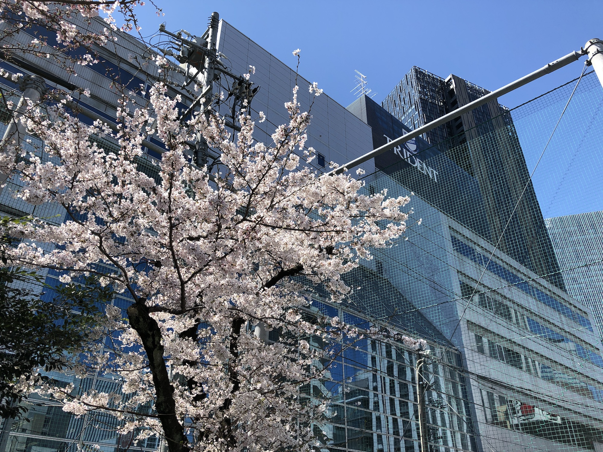

<h3 class="title is-5" >はじめてのPhotoshop</h3>
<figure class="is-fullwidth slide">
  <iframe src="https://drive.google.com/file/d/1x5DHlQvmqPhAnU2FQ7QKh70lZACCt9p1/preview"></iframe>
</figure>

<h3 class="title is-5" >桜とトライデント</h3>

画像のサイズを変更して、保存しましょう。ファイル名も変更します。

<figure class="is-fullwidth">

</figure>

画像素材:[ダウンロード](https://drive.google.com/open?id=1uwHk0hlMWwqQ1lyv1f3kB3n6oGyEXRMU)

<h3 class="title is-5" >Photoshopチュートリアル</h3>

<a href="https://helpx.adobe.com/jp/photoshop/tutorials.html" >Photoshopチュートリアル｜Adobe</a>

