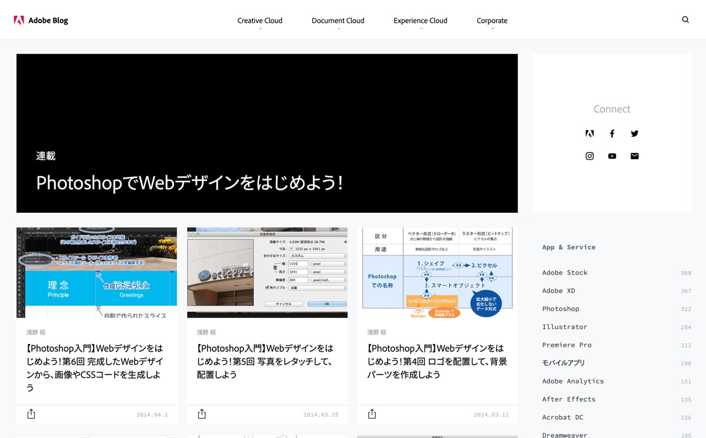

<h3 class="title is-5" >Adobe Photoshop チュートリアル</h3>
<h4 class="title is-6">PhotoshopでWebデザインをはじめよう！</h4>

2014年の記事ですが、PhotoshopでWebサイトのデザインデータ（モックアップとも言う）を作成する方法が解説されています。  
手順に沿って、制作していきましょう。

[PhotoshopでWebデザイン|Adobe blog](https://blogs.adobe.com/japan/serialization/web-start-design-with-photoshop/)

画像素材:[okumoto_image](https://drive.google.com/open?id=14IYFpjpbKJH9sW6JpPfrrQF9FalUy2TS)

