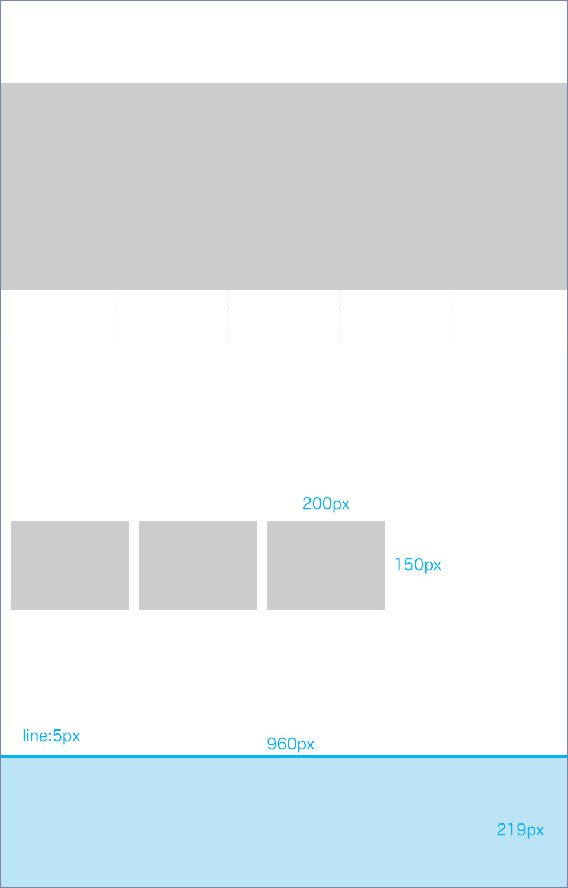

<h3 class="title is-5" >Adobe Photoshop チュートリアル</h3>
<h4 class="title is-6">PhotoshopでWebデザインをはじめよう！</h4>

2014年の記事ですが、PhotoshopでWebサイトのデザインデータ（モックアップとも言う）を作成する方法が解説されています。  
手順に沿って、制作していきましょう。

[PhotoshopでWebデザイン|Adobe blog](https://blogs.adobe.com/japan/serialization/web-start-design-with-photoshop/)

1. [PhotoshopでWebデザインをはじめよう_1](https://drive.google.com/file/d/1fp-BdZHAY9bi6Lvtsd12Gd7o3viX8gjC/view?usp=sharing)
1. [PhotoshopでWebデザインをはじめよう_2](https://drive.google.com/file/d/1XIpU4-N9b4ta5H4P2pPXjv9nTUEm8M4B/view?usp=sharing)  
1. [PhotoshopでWebデザインをはじめよう_3](https://drive.google.com/file/d/1tk7tZreIs4cXr3jmnH-uM0K9zP7flrEE/view?usp=sharing)
1. [PhotoshopでWebデザインをはじめよう_4](https://drive.google.com/file/d/1ADKf1j6rR70vctSvZhajI_qd-_nopDyT/view?usp=sharing)
1. [PhotoshopでWebデザインをはじめよう_5](https://drive.google.com/file/d/1tTCB_YTuhbx1R4WDi-3n8RdVdN-kWhQh/view?usp=sharing)
1. [PhotoshopでWebデザインをはじめよう_6](https://drive.google.com/file/d/1qpkA-f3gSPoi2WeHFHQ2MLMd7JEqiIdk/view?usp=sharing)

画像素材:[okumoto_image](https://drive.google.com/open?id=14IYFpjpbKJH9sW6JpPfrrQF9FalUy2TS)

